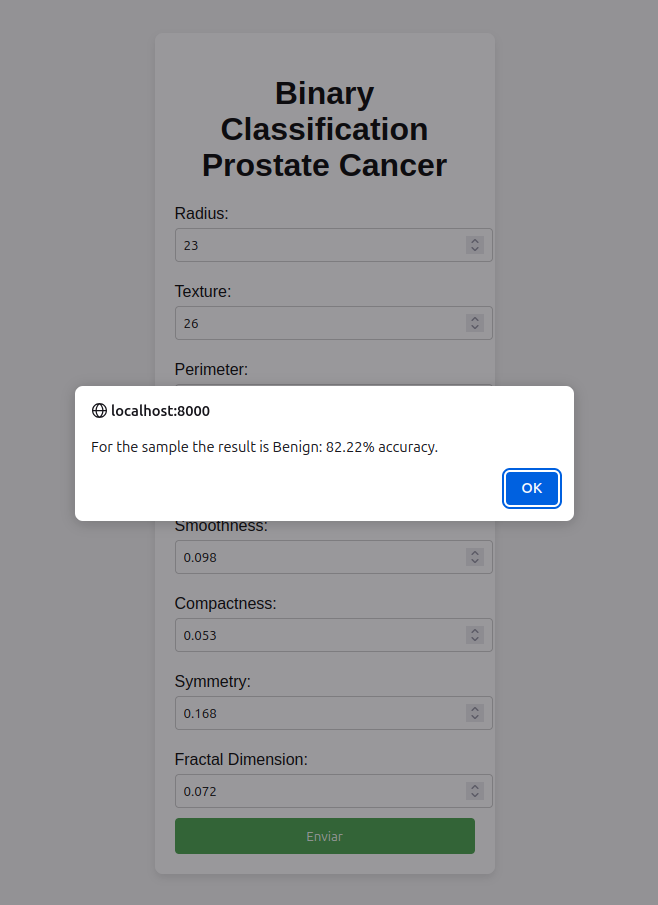

# Binary Classification - Prostate Cancer

In this project, a machine learning model was developed for binary classification, where prostate cancer tumor data was used to train the neural network with the aim of classifying the tumor as:

-   Malignant
-   Inconclusive
-   Benign

As the final result will be a value between 0 and 1, where 1 indicates a malignant tumor and 0 a benign tumor, the classification of tumors follows the following guidelines:

-   Classifications above 0.7 are considered malignant.
-   Classifications between 0.3 and 0.7 are considered inconclusive.
-   Classifications below 0.3 are considered benign.

I hope that this material can contribute in some way.

## Way of Usage:

    In the file 'load_model.py', there is an example of practical usage of the model for understanding purposes, using dictionary-type variables. However, note that the model expects data input in 'Tensor' format. Take a look at the dataset to see what is expected as parameters
    
    Step by step:
    
        1° Install the necessary libraries;
        2° Execute 'neural_network.py' to generate the model weights;
        3° Test 'load_model.py'.

## Accuracy

Validation was done through 'Cross Validation' with the dataset divided into 10 units. Obtained Model Accuracy:

-   83%

## General

    # URL to download the Dataset: https://www.kaggle.com/datasets/sajidsaifi/prostate-cancer/data
    # Number of data entries: 8
    # Number of outputs: 1
    # Number of hidden layers: 2
    # Size of hidden layers: 4
    # Model validation: Cross Validation
    # Neural network structure chosen: Feed Forward.
    # Dropout: False

    # Bias: True
    # Optimizer: Adam
    # Error Function: Binary Cross Entropy
    # Smoothing Function for Classification: Sigmoid
    # Epochs: 500
    # Learning rate: 0.001
    # Weight Decay: 0.0001
    # Batch Size in Cross Validation: 5
    # Cross Validation: 10

## Notes:

-   Reasoning behind choosing layer sizes:
    -   (8 + 1) / 2 = 4
    -   (8 * 0.66 + 1) = 7
    -   8 * 2 = 16

## Libraries Used:

-   Pandas - CSV manipulation
-   Numpy - Working with data compatible with machine learning libraries
-   Pytorch - For model development
-   Skorch and Sklearn - For data tuning and model validation/analysis processes
-   Django - For web application

  

